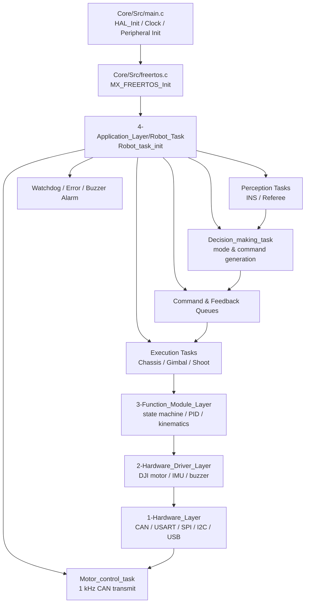
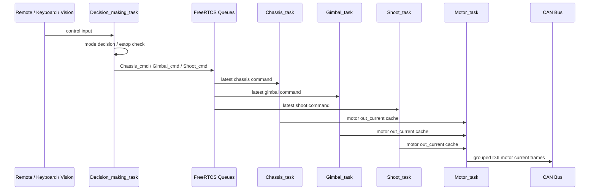

# SYSU RM Infantry


中山大学 RoboMaster 2026 赛季步兵机器人通用电控代码框架。

本仓库以 STM32F407 为主控平台，基于 STM32CubeMX、HAL、FreeRTOS 和 CMake 构建，面向步兵机器人，同时尽量沉淀为可复用于其他地面兵种的通用框架。工程采用清晰的五层架构：中间件、板级抽象、外设驱动、功能模块、应用任务。高层只依赖低层接口，底层不反向感知应用逻辑，便于后续调试、移植和多人协作开发。

> 目标不是把代码封装到难以理解，而是把硬件、算法、功能和任务边界拆清楚，让后来的人能快速找到“我要改哪里、我要接哪里、我要测哪里”。

## 特性概览

- **五层软件架构**：`0-Middleware_Layer` 到 `4-Application_Layer`，分离算法、BSP、设备驱动、功能模块和机器人任务。
- **FreeRTOS 多任务模型**：决策、底盘、云台、发射、IMU、裁判系统、电机发送、看门狗、蜂鸣器报警等任务独立运行。
- **队列式任务通信**：决策层通过 FreeRTOS Queue 向底盘、云台、发射等任务发送最新控制指令，并接收模块反馈。
- **算发分离的电机控制**：功能模块负责 PID/状态机/目标电流计算，`Motor_control_task` 以固定节拍统一发送 CAN 报文。
- **通用硬件抽象**：封装 CAN、USART、SPI、I2C、USB、DWT、Watchdog、RTT 等板级接口。
- **常用 RoboMaster 设备驱动**：DJI M3508/M2006/GM6020 电机、BMI088、HWT101/HWT606 IMU、蜂鸣器、功率计、超级电容通信等。
- **完整功能模块雏形**：底盘、云台、发射机构、裁判系统、视觉通信、遥控器/键鼠、VOFA、Shell、UI 绘制等。
- **调试与安全机制**：Letter Shell、SEGGER RTT/SystemView、VOFA、错误系统、Fatal 急停、看门狗、蜂鸣器报警。
- **配套文档**：代码规范、分层说明、模块说明、测试任务指南、RoboMaster 官方协议/手册资料。

## 总体架构



### 分层关系

```text
Application Layer    机器人任务、任务调度、队列收发、测试任务
Function Module      底盘/云台/发射/裁判/视觉/遥控等功能逻辑
Hardware Driver      外部设备驱动，如 DJI 电机、IMU、蜂鸣器、功率计
Hardware Layer       MCU 内部外设抽象，如 CAN、UART、SPI、I2C、USB、DWT
Middleware Layer     PID、滤波、Kalman、消息中心、CRC、Shell、RTT、错误系统
STM32CubeMX Core     HAL、FreeRTOS、启动文件、链接脚本、外设初始化
```

## 仓库结构

```text
.
├── README.md                         # GitHub 仓库入口说明
├── README.en.md                      # 英文模板/历史说明
├── CMakePresets.json                 # 根目录预设文件，实际工程位于 SYSU_Infantry/
├── .github/workflows/                # opencode PR/评论自动化配置
├── SYSU_Infantry.zip                 # 历史工程压缩归档，日常开发以 SYSU_Infantry/ 为准
└── SYSU_Infantry/                    # STM32 主工程
    ├── Core/                         # STM32CubeMX 生成的 main/freertos/外设初始化代码
    ├── USB_DEVICE/                   # USB CDC 设备栈配置
    ├── Drivers/                      # STM32 HAL、CMSIS、CMSIS-DSP
    ├── Middlewares/                  # FreeRTOS、ST USB Device Library
    ├── cmake/                        # ARM GCC 工具链与 CubeMX CMake 子工程
    ├── Document/                     # 队内规范、RoboMaster 官方手册与协议
    ├── 0-Middleware_Layer/           # 算法、消息中心、Shell、RTT、SystemView、错误系统
    ├── 1-Hardware_Layer/             # BSP: CAN / USART / SPI / I2C / USB / DWT / WDG
    ├── 2-Hardware_Driver_Layer/      # 外设驱动: DJI 电机、IMU、蜂鸣器等
    ├── 3-Function_Module_Layer/      # 机器人功能模块: chassis / gimbal / shoot / referee / vision
    ├── 4-Application_Layer/          # FreeRTOS 应用任务、决策任务、测试任务
    ├── SYSU_Infantry.ioc             # STM32CubeMX 工程配置
    ├── CMakeLists.txt                # 主工程构建入口
    ├── CMakePresets.json             # 工程内 CMake 预设
    └── stm32f407ighx_flash.ld        # 链接脚本
```

## 关键模块说明

| 层级 | 目录 | 作用 |
| --- | --- | --- |
| 中间件 | `0-Middleware_Layer/Pid_Controller` | PID 初始化、计算和多环控制基础能力 |
| 中间件 | `0-Middleware_Layer/Kalman_Fliter` | KF、EKF、MahonyAHRS 等姿态/状态估计算法 |
| 中间件 | `0-Middleware_Layer/Message_Center` | 发布-订阅消息中心，适合跨模块解耦通信 |
| 中间件 | `0-Middleware_Layer/Error_System` | 统一错误记录、日志输出、Fatal 急停标志 |
| 中间件 | `0-Middleware_Layer/letter-shell-master` | Letter Shell 命令行调试 |
| BSP | `1-Hardware_Layer/bsp_can` | CAN 设备注册、快速查找、回调分发与发送接口 |
| BSP | `1-Hardware_Layer/bsp_usart` | 串口注册、收发、回调与调试输出 |
| BSP | `1-Hardware_Layer/bsp_dwt` | DWT 高精度计时 |
| 驱动 | `2-Hardware_Driver_Layer/Motor_Driver` | DJI 电机抽象、反馈解析、多圈角度、PID 输出、统一 CAN 发送 |
| 驱动 | `2-Hardware_Driver_Layer/IMU_Driver` | BMI088、HWT101、HWT606 等 IMU 驱动 |
| 功能 | `3-Function_Module_Layer/Chassis` | 底盘运动学、模式切换、功率控制、电机目标计算 |
| 功能 | `3-Function_Module_Layer/Gimbal` | 云台归中、IMU/编码器反馈、Yaw/Pitch 控制 |
| 功能 | `3-Function_Module_Layer/Shoot` | 摩擦轮、拨弹盘、单发/连发/反转等发射机构逻辑 |
| 功能 | `3-Function_Module_Layer/Referee` | RoboMaster 裁判系统协议解析与 UI 绘制 |
| 功能 | `3-Function_Module_Layer/Vision_Comm` | 电控板与视觉主机通信，支持 USB/UART 配置 |
| 功能 | `3-Function_Module_Layer/Remote_Control` | DBUS/SBUS/图传链路遥控与键鼠数据解析 |
| 应用 | `4-Application_Layer/Robot_Task` | 全车任务与队列创建入口 |
| 应用 | `4-Application_Layer/Decision_Making` | 控制来源选择、模式决策、急停覆盖、指令分发 |
| 应用 | `4-Application_Layer/Execution` | 底盘、云台、发射、电机、看门狗等执行任务 |
| 应用 | `4-Application_Layer/Perception` | INS 与裁判系统感知任务 |
| 应用 | `4-Application_Layer/For_Testing_Task` | CAN 电机、遥控器、消息中心、底盘电机集成测试 |

## 运行时任务

任务入口位于 `SYSU_Infantry/4-Application_Layer/Robot_Task/robot_task.c`。

| 任务 | 文件 | 主要职责 | 当前节拍 |
| --- | --- | --- | --- |
| `Ins_task` | `Perception/Ins_Task` | 读取并更新 INS 数据，供云台/决策使用 | 1 tick |
| `Watchdog_control_task` | `Execution/Watchdog_Task` | 统一喂狗与在线状态监控 | 源码 `osDelay(100)` |
| `Motor_control_task` | `Execution/Motor_Task` | 统一发送所有 DJI 电机 CAN 电流报文 | 1 ms |
| `Referee_task` | `Perception/Referee_Task` | 裁判系统数据接收、HUD/UI 心跳刷新 | 100 ms |
| `Decision_making_task` | `Decision_Making` | 读取反馈、生成控制模式、急停检查、分发指令 | 1 tick |
| `Chassis_control_task` | `Execution/Chassis_Task` | 接收底盘指令，调用底盘功能层解算 | 队列等待 100 tick |
| `Gimbal_control_task` | `Execution/Gimbal_Task` | 解析视觉数据，处理云台控制 | 1 tick |
| `Shoot_control_task` | `Execution/Shoot_Task` | 处理摩擦轮与拨弹盘状态机 | 5 ms |
| `Buzzer_alarm_control_task` | `Buzzer_Alarm_Task` | 根据错误/状态触发蜂鸣器报警 | 由任务实现决定 |

## 控制数据流



## 快速开始

### 环境要求

- CMake `>= 3.22`
- Ninja
- Arm GNU Toolchain，确保 `arm-none-eabi-gcc`、`arm-none-eabi-g++`、`arm-none-eabi-objcopy` 在 `PATH` 中
- STM32CubeMX，修改 `.ioc` 或重新生成外设代码时需要
- 烧录/调试工具：STM32CubeProgrammer、OpenOCD、J-Link、ST-Link 或 CLion/VS Code Cortex-Debug 等

### 获取与构建

```bash
git clone https://github.com/kanbudongyeyaokan/SYSU_Infantry.git
cd SYSU_Infantry/SYSU_Infantry

cmake --preset Debug
cmake --build --preset Debug
```

构建产物默认位于：

```text
SYSU_Infantry/build/Debug/SYSU_Infantry.elf
SYSU_Infantry/build/Debug/SYSU_Infantry.map
```

Release 构建：

```bash
cmake --preset Release
cmake --build --preset Release
```

如果 CMake 提示找不到工具链，请先确认 Arm GNU Toolchain 已安装，并且 `arm-none-eabi-gcc --version` 可以在终端中正常执行。

## 开发流程建议

1. **修改外设配置**：优先在 `SYSU_Infantry.ioc` 中修改，然后谨慎重新生成 CubeMX 代码。
2. **新增 BSP**：放入 `1-Hardware_Layer/bsp_xxx`，只封装 MCU 内部外设能力。
3. **新增外部设备驱动**：放入 `2-Hardware_Driver_Layer`，例如传感器、电机、通信模块。
4. **新增机器人功能**：放入 `3-Function_Module_Layer`，在这里完成状态机、控制算法、数据融合或业务逻辑。
5. **新增任务**：放入 `4-Application_Layer`，任务中尽量只做调度、收发、调用功能层接口。
6. **加入构建**：新增 `.c/.h` 后需要同步更新 `SYSU_Infantry/CMakeLists.txt` 的源文件和 include 路径。
7. **先测后上车**：优先使用 `4-Application_Layer/For_Testing_Task` 中的测试任务验证单模块，再合入主流程。

## 上车前检查

- 确认 CAN ID、总线、终端电阻和电机型号配置正确。
- 确认云台零位、Pitch 水平位、底盘物理参数已按机械状态重新标定。
- 确认遥控器协议选择宏 `USE_SBUS_RECEIVER` 与当前链路一致。
- 确认裁判系统、视觉主机、超级电容、功率计等外设在线状态符合预期。
- 首次上电时架空底盘或拆下关键负载，先使用零力矩/低功率模式测试。
- Fatal 错误会触发全车急停，调试普通异常时不要滥用 `ERROR_FATAL`。

## 文档索引

- [电控组代码规范](SYSU_Infantry/Document/%E7%94%B5%E6%8E%A7%E7%BB%84%E4%BB%A3%E7%A0%81%E8%A7%84%E8%8C%83.md)
- [中间件层说明](SYSU_Infantry/0-Middleware_Layer/Middleware_Layer.md)
- [硬件抽象层说明](SYSU_Infantry/1-Hardware_Layer/Hardware_Layer.md)
- [硬件驱动层说明](SYSU_Infantry/2-Hardware_Driver_Layer/Hardware_Driver_Layer.md)
- [功能模块层说明](SYSU_Infantry/3-Function_Module_Layer/Function_Module_Layer.md)
- [应用层说明](SYSU_Infantry/4-Application_Layer/Application_Layer.md)
- [底盘模块说明](SYSU_Infantry/3-Function_Module_Layer/Chassis/chassis.md)
- [云台模块说明](SYSU_Infantry/3-Function_Module_Layer/Gimbal/Gimbal.md)
- [发射机构说明](SYSU_Infantry/3-Function_Module_Layer/Shoot/shoot.md)
- [DJI 电机驱动说明](SYSU_Infantry/2-Hardware_Driver_Layer/Motor_Driver/dji_motor.md)
- [快速启动指南](SYSU_Infantry/4-Application_Layer/For_Testing_Task/%E5%BF%AB%E9%80%9F%E5%90%AF%E5%8A%A8%E6%8C%87%E5%8D%97.md)
- [底盘电机集成测试指南](SYSU_Infantry/4-Application_Layer/For_Testing_Task/%E5%BA%95%E7%9B%98%E7%94%B5%E6%9C%BA%E9%9B%86%E6%88%90%E6%B5%8B%E8%AF%95%E6%8C%87%E5%8D%97.md)

## 代码规范

核心约定见 [电控组代码规范](SYSU_Infantry/Document/%E7%94%B5%E6%8E%A7%E7%BB%84%E4%BB%A3%E7%A0%81%E8%A7%84%E8%8C%83.md)，主要原则如下：

- 文件名使用小写字母和下划线，例如 `bsp_can.c`、`motor_control.h`。
- 文件夹名使用首字母大写的单词并以下划线分隔，例如 `Remote_Control`、`Gimbal_Task`。
- 变量使用 `snake_case`，宏使用全大写加下划线。
- 结构体类型以 `_t` 结尾，枚举类型以 `_e` 结尾。
- 函数尽量使用“模块 + 动作 + 对象”的命名形式，参数不宜过多。
- 底层不依赖高层；新增模块时优先保持层级方向单向清晰。

## 贡献方式

1. 从 `develop` 新建功能分支，例如 `feat/chassis-power-limit`。
2. 保持改动聚焦：一个 PR 尽量只解决一个模块或一个问题。
3. 新增模块时同步补充 `CMakeLists.txt`、必要注释和模块文档。
4. 涉及上车行为的改动，请附测试说明、风险点和回滚方式。
5. 提交 PR 后，仓库会触发 opencode review 工作流辅助检查。

## 开源与许可证

本仓库根目录当前尚未放置统一的 `LICENSE` 文件。正式开源发布前，建议维护者补充明确的开源许可证。仓库中包含 STM32 HAL、CMSIS、FreeRTOS、SEGGER RTT/SystemView、Letter Shell 等第三方组件，请同时遵守对应组件自带的许可证条款。

## 致谢

感谢中山大学 RoboMaster 电控组成员在 2026 赛季对通用步兵框架、底盘/云台/发射控制、调试工具链和工程文档的持续建设。
