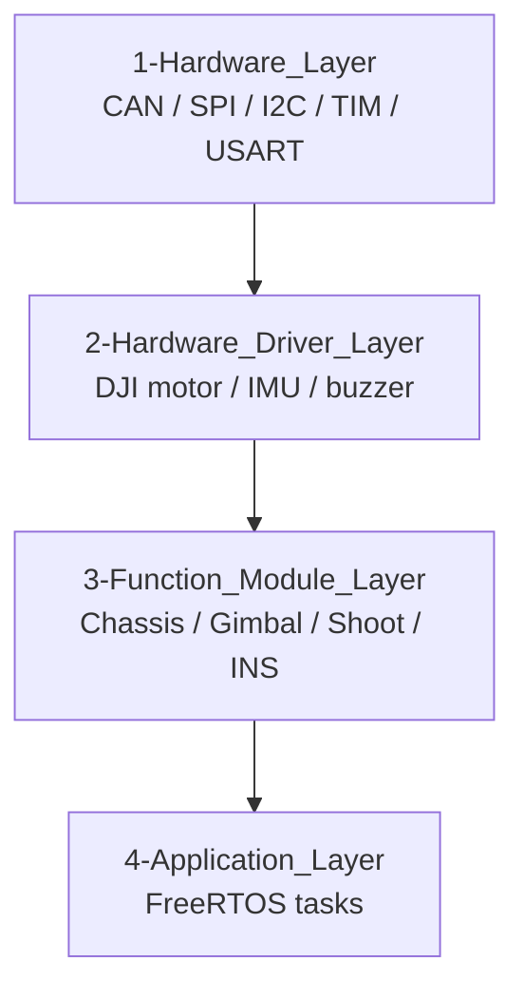

# Hardware Driver Layer 硬件驱动层说明

硬件驱动层位于 `2-Hardware_Driver_Layer/`，负责封装直接挂在 MCU 外部的设备，例如 DJI 电机、IMU、蜂鸣器等。它向功能模块层提供“设备级接口”，但不直接决定机器人处于什么模式、该往哪里运动。

简单说：

```text
BSP 层负责怎么收发
Driver 层负责这个设备的数据怎么解析、怎么控制
Function 层负责这个设备在机器人里怎么用
```

## 目录总览

| 目录 | 主要文件 | 当前职责 |
| --- | --- | --- |
| `Motor_Driver` | `dji_motor.c/.h` | DJI M3508、M2006、GM6020 通用驱动，包含反馈解析、多圈角度、PID 输出缓存、CAN 聚合发送、掉线保护 |
| `IMU_Driver/Bmi088_Driver` | `bmi088.c/.h`、`bmi088_temp.*` | BMI088 SPI 驱动，提供符合 `Ins_driver_interface_t` 的接口 |
| `IMU_Driver/Hwt606_Driver` | `hwt606_iic.*`、`hwt606_uart.*` | HWT606 IMU I2C/UART 驱动 |
| `IMU_Driver/HWT101_Driver` | `hwt101_iic.*` | HWT101 IMU I2C 驱动 |
| `Buzzer_Driver` | `buzzer_driver.*`、`buzzer_music.*` | 基于定时器 PWM 的蜂鸣器驱动和提示音乐 |

## 与上下层关系



驱动层应使用 BSP 层接口，例如：

- DJI 电机使用 `bsp_can` 注册反馈 ID 并发送控制帧。
- BMI088 使用 `bsp_spi` 做阻塞配置和 DMA 读取。
- HWT 系列 IMU 使用 `bsp_iic` 或 `bsp_usart`。
- 蜂鸣器使用 HAL TIM/PWM，但对外提供蜂鸣器对象接口。

驱动层不应该直接创建 FreeRTOS 任务，也不应该读取键鼠/遥控器控制模式。

## DJI 电机驱动

目录：`Motor_Driver`

核心接口：

```c
Djimotor_device_t *DJI_Motor_Init(Djimotor_init_config_t *config);
void Djimotor_set_target(Djimotor_device_t *motor, float target);
void Djimotor_Calc_Output(Djimotor_device_t *motor);
void Djimotor_Send_All_Bus(void);
void Djimotor_change_controller(Djimotor_device_t *motor, Djimotor_controller_init_t ctrl_params);
Djimotor_status_e Djimotor_get_status(Djimotor_device_t *motor);
Djimotor_measure_t Djimotor_get_measure(Djimotor_device_t *motor);
```

当前实现重点：

- 支持 `M3508`、`M2006`、`GM6020`。
- 支持开环、电流环、速度环、角度环、速度-电流环、角度-速度串级环。
- CAN 反馈回调解析转子角度、转速、电流、温度。
- 通过编码器过零判断维护 `total_angle` 多圈角度。
- 每个电机注册软件看门狗，离线后切到 `MOTOR_STOP`。
- `Djimotor_Calc_Output()` 只算出 `out_current`，不立即发 CAN。
- `Djimotor_Send_All_Bus()` 统一遍历所有电机，把 `out_current` 聚合到 `0x1FF/0x200/0x2FF` 控制帧发送。

这种设计让底盘、云台、发射机构可以在各自任务内独立计算输出，再由 `Motor_control_task` 保持统一 1 kHz 发送节拍。

## IMU 驱动

IMU 驱动统一通过 `3-Function_Module_Layer/Ins/ins.h` 中的接口表接入 INS 层：

```c
typedef struct {
    bool (*init)(void);
    void (*start_read)(void);
    bool (*wait_data)(void);
    void (*process_data)(Ins_data_t *out_data, float dt_s);
} Ins_driver_interface_t;
```

当前 INS 任务默认使用：

```c
const Ins_driver_interface_t *driver = BMI088_Get_Driver();
Ins_init(driver);
```

可替换为：

```c
const Ins_driver_interface_t *driver = HWT101_IIC_Get_Driver(&hi2c2);
const Ins_driver_interface_t *driver = HWT606_IIC_Get_Driver(&hi2c2);
```

新增 IMU 驱动时，只要实现同样的接口表，就可以复用 `Ins_init()`、`Ins_update()` 和 `Ins_get_data()`，上层云台/决策不需要感知底层 IMU 型号。

## 蜂鸣器驱动

目录：`Buzzer_Driver`

核心接口：

```c
void Buzzer_init(Buzzer_device_t *buzzer, TIM_HandleTypeDef *htim, uint32_t tim_channel);
void Buzzer_set_frequency(Buzzer_device_t *buzzer, uint32_t freq);
void Buzzer_set_volume(Buzzer_device_t *buzzer, Buzzer_volume_e volume);
void Buzzer_start(Buzzer_device_t *buzzer);
void Buzzer_stop(Buzzer_device_t *buzzer);
```

`buzzer_music.c/.h` 在基础频率和音量控制上封装了启动、报警、提示音乐。功能层 `3-Function_Module_Layer/Buzzer_Alarm` 会把看门狗离线和错误状态转换为报警命令，应用层 `Buzzer_Alarm_Task` 周期处理。

## 新增设备驱动流程

1. 在 `2-Hardware_Driver_Layer` 下新增设备目录。
2. 先确认它依赖哪个 BSP：CAN、USART、SPI、I2C、TIM 或 USB。
3. 定义设备配置结构体和设备实例结构体。
4. 暴露 `Init`、`GetData`、`SetTarget` 或 `Update` 等最小接口。
5. 如果设备有在线状态，注册 `bsp_wdg`。
6. 如果设备有回调，使用 BSP 的 `context` 指针把设备实例传回回调函数。
7. 在 `CMakeLists.txt` 添加 `.c` 文件和 include 路径。
8. 写一份简短模块文档，说明初始化时机、数据单位和安全默认态。

## 注意事项

- 驱动层可以保存设备静态状态，但不要直接保存机器人全局控制模式。
- 协议帧结构体必须显式对齐，尤其是 CAN、裁判系统、视觉通信这类二进制协议。
- 高频回调里不要打印大量日志；如需上报错误，应限频。
- 初始化失败必须返回 `NULL` 或进入明确错误状态，不能静默失败。
