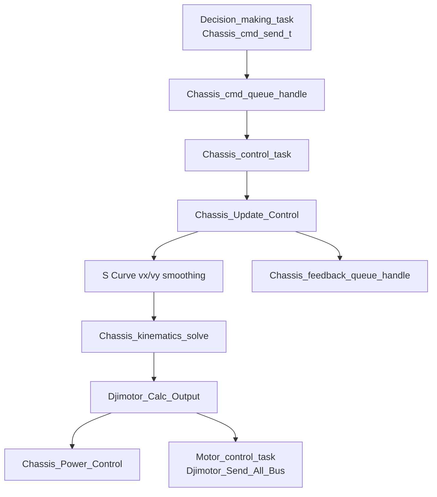

# Chassis 底盘控制模块说明

底盘模块位于 `3-Function_Module_Layer/Chassis/`，负责底盘电机初始化、底盘模式处理、运动学解算、平滑控制、跟随云台和功率限制。应用层入口是 `4-Application_Layer/Execution/Chassis_Task/Chassis_task.c`。

## 模块边界

底盘模块做：

- 初始化底盘参数和 4 个 DJI M3508 电机。
- 接收 `Chassis_cmd_send_t` 控制指令。
- 根据底盘模式计算 `vx/vy/wz`。
- 执行全向轮或麦克纳姆轮运动学解算。
- 调用 `Djimotor_set_target()` 与 `Djimotor_Calc_Output()` 缓存电机输出。
- 调用底盘功率控制，对输出电流等比例限幅。
- 写回 `Chassis_feedback_info_t`。

底盘模块不做：

- 不创建 FreeRTOS 任务。
- 不直接发送 DJI 电机 CAN 控制帧。
- 不解析遥控器或键鼠。

CAN 发送由 `Motor_control_task()` 统一调用 `Djimotor_Send_All_Bus()` 完成。

## 文件结构

| 文件 | 作用 |
| --- | --- |
| `chassis.c/.h` | 底盘初始化、模式处理、运动学解算 |
| `chassis_power_control.c/.h` | 底盘功率估算、缓冲能量防线、电流缩放 |
| `chassis_scurve.c/.h` | 底盘 `vx/vy` S 曲线平滑 |
| `chassis_ramp.c/.h` | 历史斜坡平滑实现，当前主逻辑已切到 S 曲线 |

## 数据流



## 主要接口

```c
void Chassis_task_init(void);
void Chassis_init(void);
void Chassis_Update_Control(const Chassis_cmd_send_t *cmd);
void Chassis_kinematics_solve(const Chassis_cmd_send_t *cmd, Chassis_output_t *output);
```

### `Chassis_task_init`

应用层任务启动时调用，当前会：

1. 调用 `Chassis_init()`。
2. 初始化 `Chassis_SCurve_t`。
3. 初始化底盘功率控制。

### `Chassis_init`

当前初始化参数：

| 参数 | 当前值 | 说明 |
| --- | --- | --- |
| `wheel_radius` | `60.0f` | 轮半径，单位按源码注释为 mm |
| `wheel_base` | `295.0f` | 轴距 |
| `track_width` | `295.0f` | 轮距 |
| `chassis_type` | `CHASSIS_TYPE_OMNI` | 当前默认全向轮 |
| `CHASSIS_FORWARD_ANGLE` | `0.0f` | 云台零位对应的底盘运动学坐标偏转 |

初始化的 4 个底盘电机：

| 变量顺序 | 名称 | 类型 | CAN | 控制帧 | 反馈 ID |
| --- | --- | --- | --- | --- | --- |
| `0` | `CHASSIS_FR` | M3508 | CAN1 | `0x200` | `0x201` |
| `1` | `CHASSIS_FL` | M3508 | CAN1 | `0x200` | `0x202` |
| `2` | `CHASSIS_BL` | M3508 | CAN1 | `0x200` | `0x203` |
| `3` | `CHASSIS_BR` | M3508 | CAN1 | `0x200` | `0x204` |

每个底盘电机当前使用速度环 `SPEED_LOOP`，反馈源为电机自身反馈，PID 最大输出为 `15000`。

## 控制模式

模式定义位于 `Robot_Definitions/robot_definitions.h`。

### `CHASSIS_ZERO_FORCE`

安全失能模式：

- 重置 S 曲线状态。
- `vx/vy` 置零。
- 4 个电机切到 `MOTOR_STOP`。
- 目标值置零并计算输出，最终输出为 0。

### `CHASSIS_NO_FOLLOW`

不跟随云台：

- 电机使能。
- 对 `vx/vy` 做 S 曲线平滑。
- 直接进行底盘坐标系运动学解算。

适合调试底盘自身方向和运动学。

### `CHASSIS_FOLLOW_GIMBAL`

底盘跟随云台：

- 刚切入模式时重置 `chassis_follow_pid`。
- 使用 `offset_angle` 做角度误差，目标为 0。
- `cmd_yaw` 作为云台 yaw 前馈量，叠加跟随 PID 输出。
- 把遥控器速度从云台坐标系旋转到底盘坐标系。
- 进行运动学解算。

当前跟随 PID 配置：

```c
kp = 8.0f;
ki = 0.0f;
kd = 1.0f;
max_out = 1200.0f;
deadband = 0.7f;
```

### `CHASSIS_ROTATE`

小陀螺模式：

- 电机使能。
- `wz` 固定为 `CHASSIS_ROTATE_WZ`，当前为 `500.0f`。
- 根据云台偏角旋转平移速度指令。
- 进行运动学解算。

## 运动学

当前提供两套解算：

- `Chassis_omni_kinematics()`：当前默认使用。
- `Chassis_mecanum_kinematics()`：保留麦克纳姆轮解算。

全向轮解算中会先做平移速度归一化，避免斜向移动时 `vx` 和 `vy` 叠加导致斜向速度比正向快。

## 功率控制

在 `Chassis_Update_Control()` 末尾执行：

```c
float power = PowerMeter_GetPower();
if (PowerMeter_IsOnline()) {
    Chassis_Power_Control(chassis_motors, power);
} else {
    Chassis_Power_Control(chassis_motors, -1);
}
```

`chassis_power_control` 会根据估算功率、实测功率、功率上限和缓冲能量对 4 个电机输出电流等比例缩放。功率计离线时传入 `-1`，由功率控制模块走降级逻辑。

## 应用层任务

`Chassis_control_task()` 当前逻辑：

1. 调用 `Chassis_task_init()`。
2. 从 `Chassis_cmd_queue_handle` 读取最新命令。
3. 收到命令则调用 `Chassis_Update_Control()`。
4. 100 tick 内未收到命令，则构造 `CHASSIS_ZERO_FORCE` 指令并调用更新函数。

这保证了决策任务异常或队列断流时，底盘不会继续执行旧指令。

## 调试建议

1. 先在 `CHASSIS_ZERO_FORCE` 下确认电机无输出。
2. 再用 `CHASSIS_NO_FOLLOW` 小目标测试 `vx/vy/wz` 方向。
3. 确认 4 个电机轮序与 `chassis_motors[4]` 一致。
4. 再测试 `CHASSIS_FOLLOW_GIMBAL`，校准 `YAW_CHASSIS_ALIGN_ECD` 和 `CHASSIS_FORWARD_ANGLE`。
5. 最后启用功率限制和小陀螺。

## 常见问题

| 现象 | 排查方向 |
| --- | --- |
| 电机完全不动 | 检查 `Motor_control_task` 是否运行、CAN1 是否启动、电机 ID 是否为 1-4 |
| 方向反了 | 检查轮序、安装方向、`vx/vy` 坐标约定 |
| 跟随模式抖动 | 调小跟随 PID `kp/kd`，检查 `offset_angle` 是否连续 |
| 斜向速度异常 | 检查全向轮归一化逻辑和输入单位 |
| 大功率时掉速 | 检查功率计是否在线、功率限制参数是否过严 |
