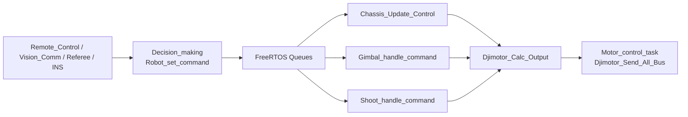

# Function Module Layer 功能模块层说明

功能模块层位于 `3-Function_Module_Layer/`，负责把底层设备驱动组合成机器人功能。它是“机器人怎么运动、怎么感知、怎么响应”的主要实现层。

这一层不创建 FreeRTOS 任务；任务入口位于 `4-Application_Layer`。功能模块层提供初始化、状态更新、控制解算和数据接口，供应用层任务周期调用。

## 目录总览

| 目录 | 主要职责 |
| --- | --- |
| `Robot_Definitions` | 全车物理参数、云台/底盘/发射机构模式枚举 |
| `Decision_making` | 控制来源选择、底盘/云台/发射指令生成、急停覆盖 |
| `Chassis` | 底盘运动学、跟随云台、小陀螺、S 曲线平滑、功率控制 |
| `Gimbal` | 云台电机初始化、IMU 反馈闭环、视觉模式目标接入 |
| `Shoot` | 摩擦轮、拨弹盘、单发/连发、堵转反转 |
| `Ins` | 标准 INS 数据结构，统一接入 BMI088/HWT 等驱动 |
| `Remote_Control` | DJI DBUS、SBUS、图传链路遥控和键鼠数据解析 |
| `Referee` | RoboMaster 裁判系统协议解析、功率热量、客户端 UI |
| `Vision_Comm` | 电控板与视觉主机的数据帧收发 |
| `Power_Meter` | CAN 功率计解析 |
| `Super_Capacitor` | 超级电容 CAN 通信 |
| `Vofa` | VOFA 调试输出 |
| `Shell` | Letter Shell 移植接口 |
| `Buzzer_Alarm` | 错误/离线状态到蜂鸣器报警命令的转换 |

## 核心数据定义

全车模式枚举位于 `Robot_Definitions/robot_definitions.h`：

```c
typedef enum {
    GIMBAL_ZERO_FORCE = 0,
    GIMBAL_GYRO_MODE,
    GIMBAL_VISION_MODE,
} gimbal_mode_e;

typedef enum {
    CHASSIS_ZERO_FORCE = 0,
    CHASSIS_NO_FOLLOW,
    CHASSIS_FOLLOW_GIMBAL,
    CHASSIS_ROTATE,
} chassis_mode_e;

typedef enum {
    SHOOT_OFF = 0,
    SHOOT_ON,
} shoot_mode_e;
```

决策层下发给执行任务的数据结构位于 `Decision_making/decision_making.h`：

- `Chassis_cmd_send_t`
- `Gimbal_cmd_send_t`
- `Shoot_cmd_send_t`

反馈结构体：

- `Chassis_feedback_info_t`
- `Gimbal_feedback_info_t`
- `Shoot_feedback_info_t`

这些结构体是功能模块层和应用层任务通信的主要契约。

## 当前主控制链路



特点：

1. 决策层维护当前控制模式和目标量。
2. 应用层通过队列把最新指令交给底盘、云台、发射任务。
3. 功能模块只计算目标和电机输出，不直接创建任务。
4. 电机 CAN 发送由 Motor Task 统一完成。

## 与应用层的边界

功能模块层应暴露类似下面的接口：

```c
void Chassis_task_init(void);
void Chassis_Update_Control(const Chassis_cmd_send_t *cmd);

void Gimbal_task_init(void);
void Gimbal_handle_command(Gimbal_cmd_send_t *cmd);

void Shoot_task_init(void);
void Shoot_handle_command(Shoot_cmd_send_t *cmd);
```

应用层任务负责：

- 调用模块初始化。
- 从队列读取指令。
- 周期调用功能层处理函数。
- 把必要反馈写回队列。

功能模块层不应直接调用 `osThreadCreate()`。

## 主要功能模块摘要

### 底盘

底盘当前默认为全向轮配置，初始化 4 个 M3508 电机，支持：

- `CHASSIS_ZERO_FORCE`
- `CHASSIS_NO_FOLLOW`
- `CHASSIS_FOLLOW_GIMBAL`
- `CHASSIS_ROTATE`

控制内包含 S 曲线平滑、云台角度补偿、跟随 PID、功率计/功率限幅逻辑。

### 云台

云台初始化 Yaw/Pitch 两个 GM6020：

- Yaw 使用 INS `total_yaw` 和 `gyro_body.z` 作为反馈。
- Pitch 使用 INS 姿态数据和角速度反馈。
- 支持零力矩、IMU 角度模式、视觉目标模式。
- 视觉通信默认通过 USB CDC。

### 发射机构

发射机构包含两个 M3508 摩擦轮和一个 M2006 拨弹盘：

- 摩擦轮目标转速当前为 `FRICTION_WHEEL_TARGET_RPM = 6700`。
- 单发按固定角度步进。
- 连发按 `shoot_rate` 计算间隔。
- 带电流堵转检测和反转退弹逻辑。

### INS

INS 层通过统一驱动接口接入不同 IMU，并向上层提供：

```c
const Ins_data_t *Ins_get_data(void);
```

云台控制、视觉发送、决策反馈都依赖 INS 输出的姿态和角速度。

### 裁判与功率

裁判系统解析比赛状态、机器人状态、功率热量、射击数据等。底盘功率控制当前可使用功率计数据，也保留了超级电容通信接口。

## 新增功能模块建议

1. 在 `3-Function_Module_Layer` 下新增目录。
2. 对外暴露 `xxx_init()`、`xxx_update()`、`xxx_get_data()` 等简洁接口。
3. 不在功能层创建任务。
4. 需要电机时通过 `DJI_Motor_Init()` 注册，通过 `Djimotor_Calc_Output()` 缓存输出。
5. 需要跨任务通信时优先定义清晰结构体，再由应用层决定使用 Queue 或 Message Center。
6. 新增状态枚举时优先放在 `Robot_Definitions` 或对应模块头文件中。
